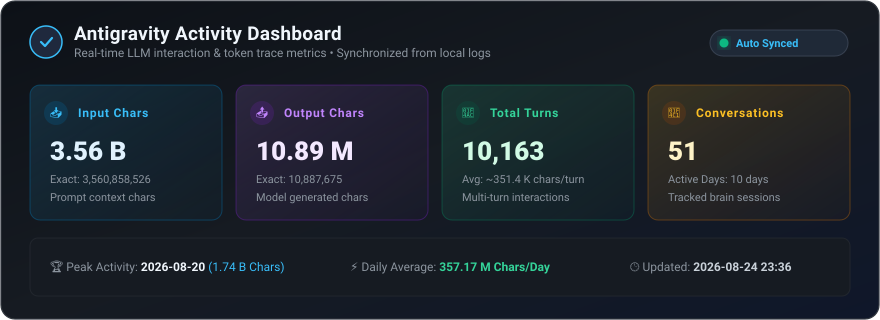
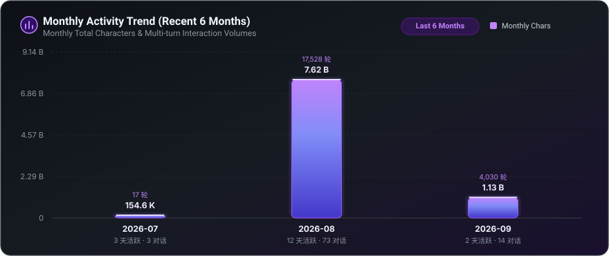
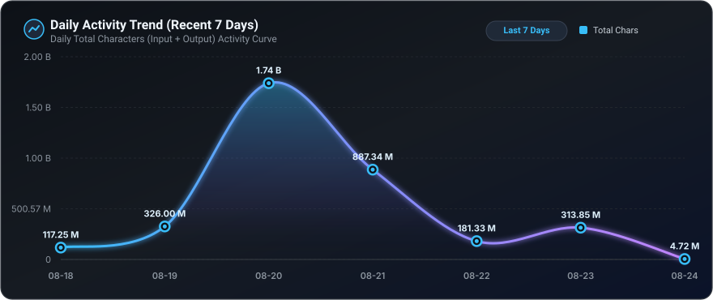

<div align="center">

# ⚡ Antigravity Token & Activity Stat Tracker

<p align="center">
  <b>精细化追踪、聚合与可视化 Google Antigravity (AGY) 本地会话的 Token、字符与交互轮数统计</b>
</p>

<p align="center">
  
  
  
  
  
</p>

</div>

---

## 📊 Overview Metrics

<div align="center">
  
</div>

<br/>

## 🗓️ Monthly Trend (Recent 6 Months)

<div align="center">
  
</div>

<br/>

## 📅 Daily Activity Trend (Recent 7 Days)

<div align="center">
  
</div>

<br/>

---

## 📑 详细统计表格

<details open>
<summary><b>🗓️ 按月汇总记录 (Monthly Summary)</b></summary>
<br/>

| 月份 | 活跃天数 | 对话数 | 交互轮数 | 输入字符 | 输出字符 | 总字符消耗 |
| :--- | :---: | :---: | :---: | :---: | :---: | :---: |
| `2026-08` | 4 天 | **41** | 8,710 | 3,062,633,064 | 9,057,102 | **3,071,690,166** |
| `2026-07` | 3 天 | **3** | 17 | 132,988 | 21,631 | **154,619** |

</details>

<br/>

<details open>
<summary><b>📅 按日明细记录 (Daily Breakdown)</b></summary>
<br/>

| 日期 | 对话数 | 交互轮数 | 精准输入字符 | 精准输出字符 | 精准总字符消耗 |
| :--- | :---: | :---: | :---: | :---: | :---: |
| `2026-08-21` | **8** | 2,540 | 884,411,242 | 2,924,912 | **887,336,154** |
| `2026-08-20` | **25** | 4,477 | 1,736,648,825 | 4,451,733 | **1,741,100,558** |
| `2026-08-19` | **2** | 773 | 325,179,965 | 821,305 | **326,001,270** |
| `2026-08-18` | **6** | 920 | 116,393,032 | 859,152 | **117,252,184** |
| `2026-07-22` | **1** | 11 | 111,891 | 14,796 | **126,687** |
| `2026-07-20` | **1** | 1 | 425 | 95 | **520** |
| `2026-07-17` | **1** | 5 | 20,672 | 6,740 | **27,412** |

</details>

<br/>

---

## 🚀 核心特性

- 🎯 **精准统计**：基于本地 Antigravity 真实 Trace 轨迹（`transcript.jsonl`），逐轮计算多轮对话上下文累加输入字符与输出字符。
- 🛡️ **智能防丢与合并策略**：
  - 用户清理本地历史会话时，旧日期的记录**永久保留在 JSON 中**。
  - 同一天内多次执行时，数据采用 `Math.max(历史值, 新值)`，确保单调递增不回退。
- 🎨 **纯原生零依赖 SVG 渲染**：无需 Canvas 或 Native 依赖，秒级生成现代化暗黑拟态图表（支持近 6 个月月度统计与近 7 天日度趋势）。
- ⚡ **一键本地全自动联动**：执行 `node analyze.js` 即可自动同步 JSON、重绘 SVG 看板并刷新 README。

---

## 💻 快速使用

### 1. 扫描并同步最新本地轨迹
```bash
# 扫描本地 Antigravity Trace 并更新 stats.json & 生成图表
node analyze.js
```

### 2. 独立生成 / 刷新图表与 README
```bash
node generate.js
```

### 3. CLI 高级选项
```bash
node analyze.js --help

Options:
  --ratio <num>        字符与 Token 换算比例 (默认: 3.5)
  --days <num>         终端按日表格展示最近天数 (默认: 30)
  --month <str>        过滤指定月份 (如 2026-08)
  --no-daily           仅显示按月汇总表格
  --output, -o <path>  指定 JSON 输出路径 (默认: stats.json)
  --no-json            不写入/更新 JSON 文件
```

---

<div align="center">
  <sub>Last Synced: <code>2026-08-21 20:06</code> • Powered by <b>Antigravity Stat Tracker</b></sub>
</div>
